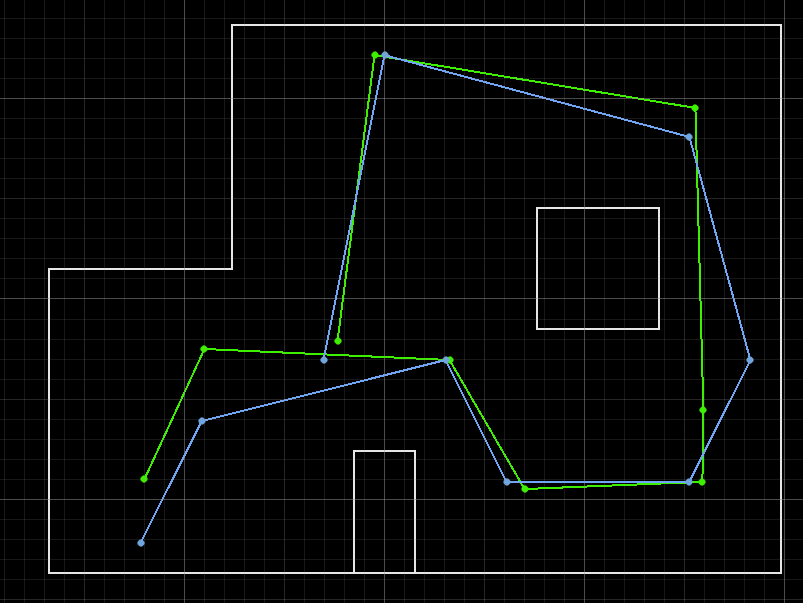

# Path Planning and Execution – Embedded System with Real-World Localization

This project implements a full localization and navigation system on a self-built autonomous robot, developed for a course in embedded systems. The robot was programmed in **MATLAB**, integrated with onboard C code, and deployed on hardware that was **modified from a toy RC car**. The final system successfully navigates between waypoints, maps its surroundings, and localizes itself using **Bayes filtering**, **Kalman-filtered sensor data**, and **PID control**.

> Embedded systems project using MATLAB + BLE control  
> Robot built by modifying a toy car and integrating custom electronics  
> [View Full Hardware and Software Report](./index.html)

---

## Robot Hardware Overview

The robot was constructed by retrofitting a toy car chassis with:

- **Artemis microcontroller** (RedBoard Artemis Nano)  
  - Sends PWM signals to control motor speed and direction  
  - Handles onboard Kalman filtering and sensor polling

- **Two motor drivers**  
  - Independently control the left and right wheels  
  - Enable smooth turning and straight motion via PID

- **VL53L0X Time-of-Flight (ToF) sensor**  
  - Mounted on a servo for rotational scanning  
  - Provides accurate distance readings used for both mapping and position control

- **MPU6050 IMU sensor**  
  - Supplies rotational velocity and orientation data  
  - Used in PID turning and stability control

- **Bluetooth Low Energy (BLE)** communication  
  - Allows for wireless control and data streaming between robot and Jupyter Lab

The hardware was mounted on a custom laser-cut acrylic platform with power regulation and wiring secured for real-world testing:contentReference[oaicite:0]{index=0}.

---

## Sensor Fusion and Filtering

To increase precision in movement and mapping, the ToF sensor’s noisy output was processed using a **1D Kalman filter**, implemented directly on the Artemis board. This improved:

- Distance measurement stability
- Control accuracy during forward motion
- Localization confidence by providing clean scan data:contentReference[oaicite:1]{index=1}

---

## Mapping and Localization

A full **localization pipeline** was implemented:

1. The robot rotates 360° using the servo-mounted ToF sensor, collecting 18 measurements at 20° increments.
2. This scan is transmitted via BLE to MATLAB.
3. A **Bayes filter** is applied in MATLAB using a known environment map.
4. The result is a probabilistic estimate of the robot’s pose `(x, y, θ)`.
5. This pose is used to guide the next navigation step, correcting for drift:contentReference[oaicite:2]{index=2}.

---

## Path Planning and Execution

The core navigation routine is handled by a MATLAB function `navigate_to_target`, which performs the following:

1. **Turn to face the target waypoint**  
   - Uses `pid_orient_imu` with IMU feedback for angular correction
2. **Drive forward**  
   - Uses `pid_position_tof` with ToF sensor for distance control
3. **Reorient to 0°**  
   - Standardizes robot heading for the next localization phase

Each phase is controlled by loop counters and PID tuning, ensuring the robot does not stall or overshoot.



---

## Top-Level Controller

The robot repeatedly performs the following loop:

```text
1. Localize via 360° scan
2. Navigate to next waypoint
3. Reset heading to 0°
4. Re-localize
5. Repeat until all waypoints are visited
